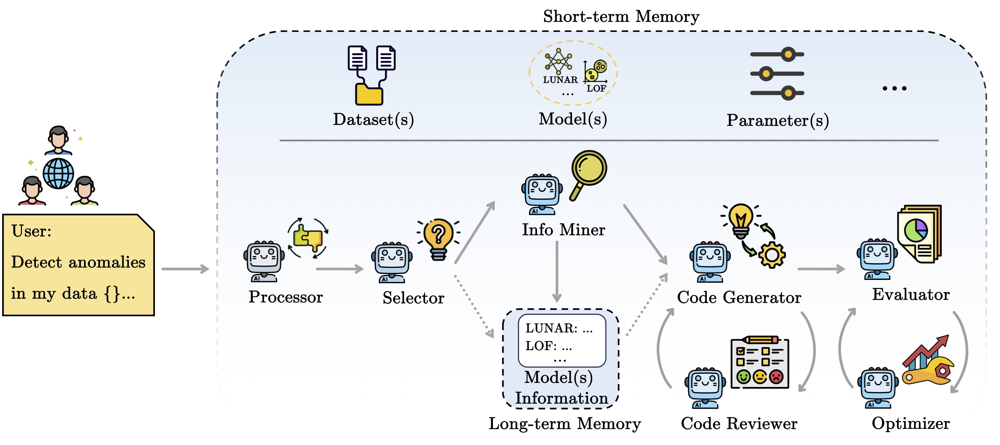
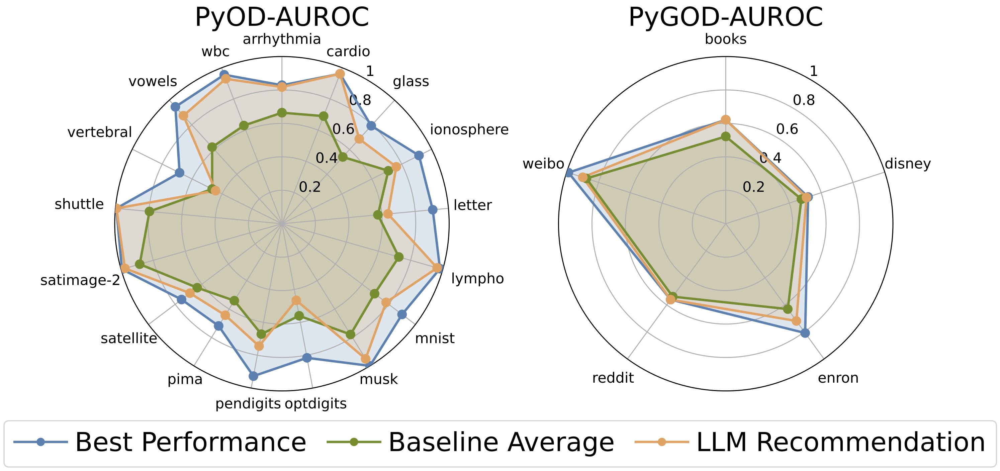

# AD-AGENT

**AD-AGENT** is an LLM‑driven multi-agent anomaly detection platform designed to support the full lifecycle of real-world anomaly detection—from data preprocessing and model selection to detection, explanation, and evaluation. It integrates classical and graph-based AD algorithms with LLM-powered modules for enhanced usability, privacy, and adaptability.



> 🔍 One platform. Multiple agents. All your anomaly detection workflows—automated, explainable, and secure.

---


## 📝 Citation

If you find this work useful, please cite our paper: [https://arxiv.org/abs/2505.12594](https://arxiv.org/abs/2505.12594)

```json
@article{yang2025ad,
  title={AD-AGENT: A Multi-agent Framework for End-to-end Anomaly Detection},
  author={Yang, Tiankai and Liu, Junjun and Siu, Wingchun and Wang, Jiahang and Qian, Zhuangzhuang and Song, Chanjuan and Cheng, Cheng and Hu, Xiyang and Zhao, Yue},
  journal={arXiv preprint arXiv:2505.12594},
  year={2025}
}
```

---

## ✨ Features

- **Unified Multi-modal-library Automation**: Supports multiple domain-specific AD libraries (PyOD for multivariate data, PyGOD for graph data, and TSLib for time series) and enables end-to-end, cross-modality pipeline construction from natural language.
- **Accessible to Non-experts**: Enters a sentence such as "Detect anomalies in cardio.mat" and obtains an executable script without hand‑written code.
- **Multi-Agent Architecture**: Processing, detection, explanation, and adaptation are handled by decoupled agents with clear APIs and extendability.
- **Automatic Model Suggestion**: Leverages the reasoning ability of the LLM to recommend competitive algorithms when no specific model is provided.
- **Privacy-Aware Design** (in progress): Includes a framework for anonymizing data before AD processing, suitable for regulated domains.
- **Human-in-the-loop Support** (in progress): Enables analysts to query explanations and iterate on detection results interactively.

> Please find more details in our paper [here](https://arxiv.org/abs/2505.12594).


---

## 🔧 Setup Instructions

### 1. Clone the Repository

```bash
git clone git@github.com:USC-FORTIS/AD-AGENT.git
cd AD-AGENT
```

### 2. Create and Activate a Virtual Environment

#### On macOS/Linux:

```bash
python -m venv .venv
source .venv/bin/activate
```

#### On Windows:

```bash
python -m venv .venv
.venv\Scripts\activate
```

### 3. Install Dependencies

```bash
pip install pyg_lib torch_scatter torch_sparse torch_cluster torch_spline_conv -f https://data.pyg.org/whl/torch-2.5.0+cpu.html

pip install -r requirements.txt
```

### 4. Set Your OpenAI API Key

Edit the config file to include your OpenAI API key:

```python
# File: /config/config.py

OPENAI_API_KEY = 'your-api-key-here'
```

---

## 🚀 Running the Program

### Run Normally (Sequential Execution)

```bash
python main.py
```

### Run in Parallel Mode

```bash
python main.py -p
```

### Run in Optimizer Mode

```bash
python main.py -o
```

---

## 🧪 Test Commands

You can also run the system with natural-language-like test commands.

### Run a Specific Algorithm

```text
# PyOD
Run IForest on ./data/glass_train.mat and ./data/glass_test.mat
Run all on ./data/glass_train.mat and ./data/glass_test.mat
# PyGOD
Run DOMINANT on ./data/inj_cora_train.pt and ./data/inj_cora_test.pt
# TSLib 
Run LightTS on ./data/MSL and ./data/MSL
# Darts (in progress)
Run GlobalNaiveAggregate on ./data/yahoo_train.csv and ./data/yahoo_test.csv

```


### Run All Algorithms

```text
Run all on ./data/glass_train.mat and ./data/glass_test.mat
```

---

## 📁 Project Structure

```
.
├── config/
│   └── config.py             # Configuration file for API keys
.
.
.
├── data/
│   └── glass.mat             # Sample dataset
├── main.py                   # Main execution script
├── requirements.txt          # Required Python packages
└── README.md                 # Project documentation
```

---

## 📊 Experiments

- Pipeline generation performance by library, showing success rate (code runs without error), average latency, LLM token usage (input/output), and per-pipeline billing cost in US dollars. The time spent in Reviewer is related to the complexity of models, which explains the increase in TSLib. **AD-AGENT demonstrates high reliability in producing valid pipelines across modalities, with low latency and manageable cost.**
- Model selection results for PyOD and PyGOD. We display the average AUROC of models recommended by querying the reasoning LLM three times (duplicates allowed). "Best Performance" marks the highest performance achieved by any available model for each dataset, while "Average Baseline" denotes the mean performance across all available models. **The LLM's recommendations substantially exceed the average baseline and closely track the best performance in most datasets.**

---

## 📌 Notes

- Make sure your dataset is placed inside the `./data/` directory.
- Modify `main.py` to add support for additional algorithms or datasets if needed.

---

## 👥 Contributors

<a href="https://github.com/USC-FORTIS/AD-AGENT/graphs/contributors">
  
</a>

Made with [contrib.rocks](https://contrib.rocks).
